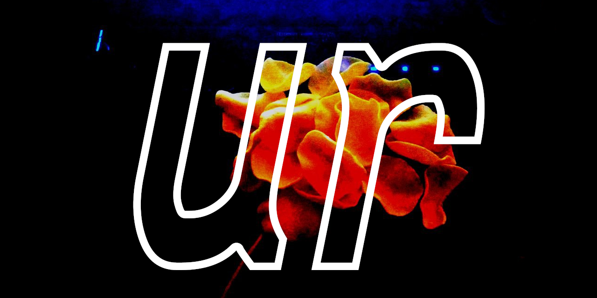
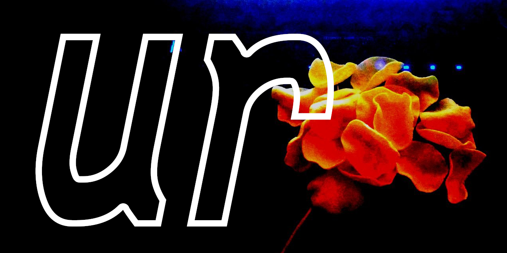

# Ur logos

A square logo.

  

A landscape logo with centered text.

  

A landscape logo with left aligned text.

  

### License

The Ur is developed by Pellegrino Prevete and released under the
terms of the GNU Affero General Public License version 3.
